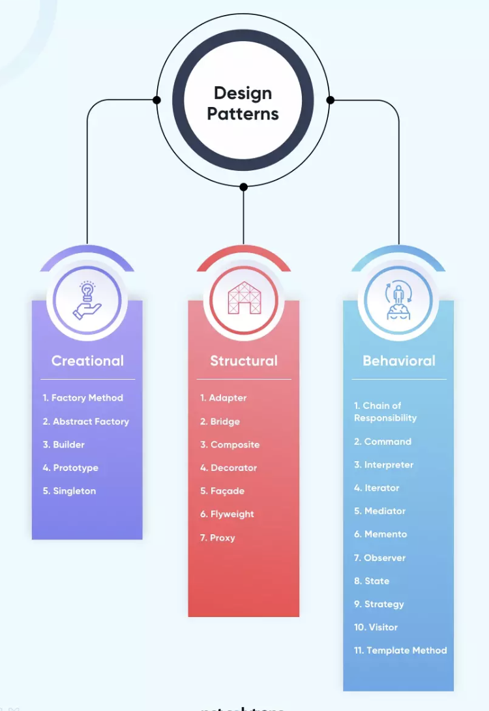

# Software Design Pattern Overview:

### Overview:
* A **software design pattern** is a **general, reusable solution** to a **commonly occurring problem** in **software 
  design**
* It is a **template** or **blueprint** that provides a **structured and proven** approach to solving **specific types 
  of problems** in **software development**
* Design patterns help developers create software that is more **maintainable**, **scalable**, and **easy to 
  understand** by promoting **best practices** and **standardizing solutions** to **common problems**
* Design patterns are **not specific to a particular programming language or technology but** can be applied to various 
  **programming paradigms** and **languages**
* They serve as a **shared vocabulary for developers** to **communicate and collaborate** on **software design**
* There are many design patterns, and they can be categorized into several groups, including:
  * **Creational Patterns:**
    * These patterns deal with **object creation mechanisms**, trying to **abstract the instantiation process**, making 
      it **more flexible** and **reusable**
    * Examples include the **Singleton**, **Factory Method**, and **Abstract Factory** patterns
  * **Structural Patterns:**
    * These patterns focus on the **composition of classes and objects** to **form larger structures**
    * They help define **how objects and classes can be combined** to **form new structures**
    * Examples include the **Adapter**, **Composite**, and **Decorator** patterns
  * **Behavioral Patterns:**
    * Behavioral patterns are concerned with the **interaction and communication between objects and classes**
    * They define the **responsibilities and collaboration between objects**
    * Examples include the **Observer**, **Strategy**, and **Command** patterns
* Design patterns are **not mandatory** in software development, but they offer **guidance** and **best practices** that 
  can **improve the quality of software** and make it **easier to maintain and extend** over time
* Developers often use design patterns as a **tool** to **solve common problems** and **promote code reusability** and 
  **maintainability**
* 